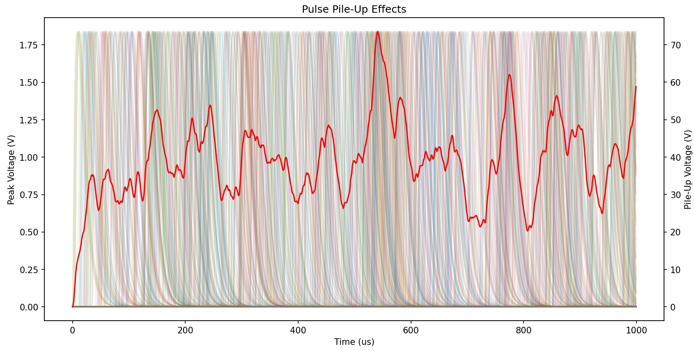

# pileup-visual
**Simple tool for visualizing pulse pileup in radiation detectors.**

To use this tool, simply call it from the command line, adding an argument for the frequency you would like to simulate. Note that the frequency must be greater than 1 KHz due to under/over flow issues.

```
python pulse.py <frequency in Hz>
```

## Example
**Input**
```
python pulse.py 1000000
```
**Output**
Simulating incoming radiation at 1.0 MHz for 1000 microseconds.

